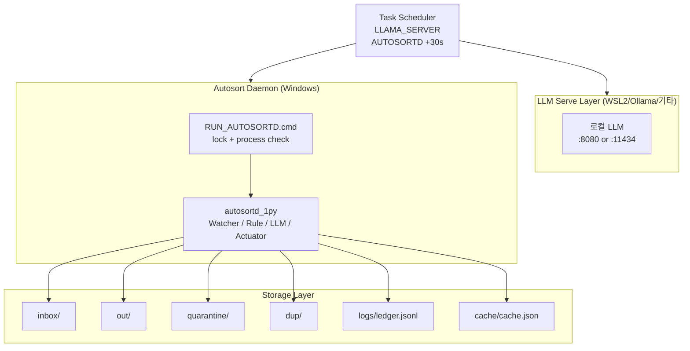
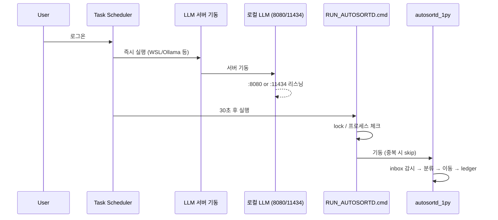
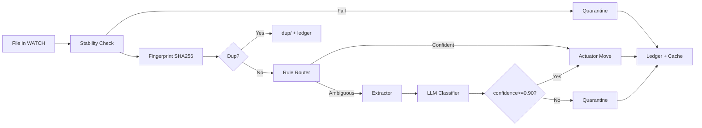
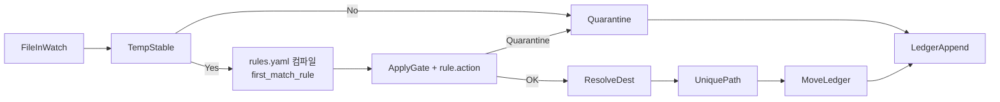

# 시스템 아키텍처 — LOCAL-AUTOSORT SSOT (통합)

로컬 PC: HP OMEN 16-wf0xxx (x64, Intel i5-13500HX, 32GB RAM). 설계·구현·배포를 단일 문서로 통합.

---

## 1. 개요 (Executive Summary)

- **목표**: 로컬 폴더(개발 파일 + 문서)를 **완전자동**으로 분류/이동하고, **Undo** 및 **감사로그(ledger)**를 남긴다.
- **핵심 원칙**: **(1) 삭제 0%**, **(2) 개발 파일/폴더 리네임 금지**, **(3) 룰 우선(90%)**, **(4) 불확실=격리(Quarantine)**, **(5) 모든 변경은 ledger로 롤백 가능**.
- **런타임 SSOT**: 로컬 LLM 서버 1개(WSL2 llama-server / Windows Ollama / LM Studio 등) + Windows Python Watcher 데몬(autosortd_1py). 배포 시 작업 스케줄러로 로그온 시 자동 기동.

---

## 2. EN Sources (≤3)

- [Llama.cpp](https://llama-cpp.com/) — OpenAI API 호환 엔드포인트 (`/v1/chat/completions` 등)
- [Qwen2-1.5B Instruct Q4_K_M GGUF](https://huggingface.co/itlwas/Qwen2-1.5B-Instruct-Q4_K_M-GGUF) — `llama-server --hf-repo --hf-file -c 2048` 사용 예
- [n8n 로컬 파일 트리거](https://n8n.io/workflows/2334-organise-your-local-file-directories-with-ai/) — 고빈도 시 타이머 전환 참고

---

## 3. 시스템 범위 / 비범위

**범위(In-Scope)**

- 로컬 폴더 감시 → 자동 분류 → 목적지로 이동
- 개발 파일: 소스/설정 **리네임 금지**
- 문서: 규칙+선별 LLM로 분류, 필요 시 파일명 규칙
- 중복(해시) → `dup/`, 불확실/오류 → `quarantine/`
- 모든 조작 → `logs/ledger.jsonl` + 롤백

**비범위(Out-of-Scope)**

- 파일 내용 편집(예: PDF 수정)
- 외부 클라우드 업로드/동기화
- 자동 삭제
- 전체 디스크 인덱싱(watch 폴더만)

---

## 4. 제약(Constraints)

| No | Item   | Value                    | Risk       |
| -- | ------ | ------------------------ | ---------- |
|  1 | HW     | x64, Intel i5-13500HX, 32GB RAM (로컬 확인) | Medium(속도) |
|  2 | 파일 유형 | 개발+문서 혼재           | Medium(오분류) |
|  3 | 완전자동 | 사용자 승인 없이 move/rename | Medium(사고) |
|  4 | 안전   | 삭제 0%, Undo 필수       | Low        |

---

## 5. 목표 KPI

- 자동 적용률 ≥ 85%
- 격리 비율(Quarantine) ≤ 15%
- 중복 탐지율 추적
- 처리 지연(TAT) 평균 ≤ 5s/파일(LLM 제외)
- 롤백 성공률 100%

---

## 6. 상위 아키텍처 — 레이어/컴포넌트



- **LLM Serve Layer**: 로컬 모델 서버 1개. 기본 8080(llama.cpp/WSL) 또는 11434(Ollama). `--llm`으로 본인 환경에 맞게 지정.
- **Autosort Daemon**: RUN_AUTOSORTD.cmd(중복 방지) → autosortd_1py (Watcher, Rule Router, Extractor, LLM Classifier, Actuator, Ledger/Cache)
- **Storage**: inbox, out, quarantine, dup, logs, cache

---

## 7. 배포/기동 — 로그온 시 순서



- **LLM 서버**: 로그온 시 WSL이면 `start_llama_server.cmd` → `~/svc/run_llama_server.sh`. Ollama면 `ollama serve` 등 별도 기동.
- **AUTOSORTD**: 로그온 30초 지연(PT30S) 후 `RUN_AUTOSORTD.cmd`. 등록: 관리자 PowerShell에서 `register_autosort_tasks.ps1` 실행.

---

## 8. 데이터 흐름

### 8.1 전체 설계(룰 90% + LLM 10%)



### 8.2 현재 구현 (autosortd_1py + YAML)



- **TempStable**: `.crdownload`/`.part`/`.tmp` 크기 안정 후에만 진행.
- **Classify**: `rules.yaml` + `mapping.yaml` 컴파일 → `first_match_rule` (rule `action` 적용 시 강제 quarantine).
- **ApplyGate**: confidence &lt; threshold 또는 quarantine_doc_types → quarantine.
- **ResolveDest**: mapping.yaml의 doc_type_map + tag_overrides. **UniquePath**: 충돌 시 `__{short_hash}` suffix.

---

## 9. 폴더/데이터 구조 (SSOT)

`--base`(기본 `C:\_AUTOSORT`) 기준:

```text
{base}/
  inbox/              # 감시 대상 (watch)
  staging/            # 원자적 이동용
  out/
    Dev/Repos|Archives|Config|Notes/
    Docs/Ops|Other/
  quarantine/
  dup/
  logs/
    ledger.jsonl      # 모든 이동 기록 (before, after, reason, run_id)
    autosortd_runner.log   # RUN_AUTOSORTD 중복 skip/실행 로그
  cache/
    cache.json        # SHA256 → 결정/목적지 캐시
    autosortd_watch_inbox.lock/   # 중복 실행 방지 lock
  rules/
    rules.yaml
    mapping.yaml
```

**카테고리 정책**: dev_code/dev_repo/dev_config는 **리네임 금지**. 문서(ops_doc/other)만 리네임 허용. zip/압축 → Dev/Archives.

---

## 10. 구성요소 (autosortd_1py 단일 진입점)

| 구성요소 | 설명 |
|----------|------|
| **autosortd.py** | **미구현(레거시).** 문서상 1회 스캔 역할은 autosortd_1py.py `--once`/`--dry-run`로 대체. |
| **autosortd_1py.py** | **단일 진입점.** 데몬(Watchdog, LLM, staging, dup, 캐시) + `--once` 1회 스캔 + `--dry-run` 분류만. `--root`/`--base` alias. `C:\_AUTOSORT` 복사 후 **RUN_AUTOSORTD.cmd**로 기동. |
| **RUN_AUTOSORTD.cmd** | CIM 프로세스 체크 + `cache\autosortd_watch_inbox.lock` + stale lock 정리. 로그: `logs\autosortd_runner.log`. |
| **작업 스케줄러** | `\AUTOSORT\LLAMA_SERVER`, `\AUTOSORT\AUTOSORTD`(PT30S). 등록: `register_autosort_tasks.ps1`(관리자). |
| **저장소** | inbox, out, quarantine, dup, logs, cache (위 트리). |

---

## 11. 분류 엔진 (룰 90% + LLM 10%)

### Pass-0 Rule Router (LLM 호출 금지)

- 확장자: 소스/설정(`.py .js .ts .json .yml …`) → Dev/Repos(리네임 금지). 압축 → Dev/Archives. 임시(`.crdownload` 등) → Stable check 후 진행/실패 시 quarantine. 노트(`.md .txt`) → Dev/Notes.
- 키워드: AGI_TR, DPR, Mammoet, Verification, Chartering 등 → Docs/Ops.

### Pass-1 LLM Classifier (선별)

- 호출: Pass-0에서 확신 낮은 PDF/DOCX/XLSX.
- 입력: file_meta + content_snippet(앞 2500자) + naming_rule.
- 출력: JSON 고정 스키마(doc_type, confidence, suggested_name, reasons 등).

---

## 12. LLM 인터페이스 계약

- **Endpoint**: `POST {base_url}/v1/chat/completions` (예: llama.cpp `http://127.0.0.1:8080/v1`, Ollama `http://127.0.0.1:11434/v1`).
- **Output**: doc_type, project, vendor, date, suggested_name, confidence, reasons (고정 스키마).
- **결정론**: temperature=0, 스니펫 길이/프롬프트 템플릿 고정.

---

## 13. Actuator / Ledger·Undo

- **원자적 이동**: watch → staging → out/quarantine/dup. 실패 시 원복(best-effort).
- **충돌**: 동일 파일명 시 `__{short_hash}`(8자 hex) suffix.
- **삭제 금지**: 중복→dup/, 불확실→quarantine/.
- **Ledger(JSONL)**: ts, run_id, action=move, sha256, reason, before, after.
- **Rollback**: run_id 기준 after→before 역순 이동.

---

## 14. 운영/배포

- **LLM**: WSL2 시 `~/svc/run_llama_server.sh`(Qwen2-1.5B Q4_K_M 등). Windows Ollama 시 `ollama serve`. LM Studio 등 OpenAI 호환 엔드포인트 사용 가능. `--llm`으로 URL 지정.
- **Windows 데몬**: `--watch` 1개(기본 inbox). 로그온 시 작업 스케줄러로 자동 기동. 고빈도 시 타이머 스윕(예: 30s) 권장.

---

## 15. 구현 비교 (autosortd_1py 기준)

| 항목 | autosortd.py (미구현/레거시) | autosortd_1py.py (현재 구현) |
|------|-----------------------------|------------------------------|
| 실행 | (미구현) | Watchdog 데몬 + `--sweep` + `--once` 1회 스캔 + `--dry-run` |
| 분류 | 문서만 | YAML 규칙 컴파일 |
| LLM | (미구현) | 있음(선별) |
| Staging | (미구현) | 있음 |
| Dup | (미구현) | sha256 + cache |
| Temp 안정성 | (미구현) | wait_until_stable timeout 기반 |
| Ledger | 문서만 | 있음 |

---

## 16. E2E 검증

- **감시 → 분류 → 이동 → ledger** 파이프라인: inbox 파일 생성 시 out/Dev/Notes 등으로 이동, ledger.jsonl 갱신 확인 (예: AUTOSORTD_TEST_*.txt). [out/Dev/Notes/SYSTEM_STATUS_2026-02-28.md](out/Dev/Notes/SYSTEM_STATUS_2026-02-28.md) §8 참고.

---

## 17. 보안/안전

- 로컬 파일만 처리. Allowlist 폴더만 watch.
- Denylist: 시스템 폴더, OneDrive 루트, 대용량 백업.
- PII: 정리만 수행, 내용 추출 최소(상단 스니펫 등).

---

## 18. 테스트 전략

- 단위: 확장자/키워드 룰, safe_filename, ledger 누락 여부, rollback 성공.
- 회귀: 샘플 100개로 자동 적용률/격리율/충돌율 비교.

---

## 19. Options (A/B/C)

| Option | 설명 | 비고 |
|--------|------|------|
| **A — DEV-PRESET** | 룰 90% + LLM 10% | **추천**. CPU에서 빠름, 리네임 금지. |
| B — Full-LLM | 모든 파일 LLM | CPU에서 느림, 비권장. |
| C — n8n 워크플로우 | 로컬 트리거/타이머 | GUI 관리, 초기 셋업 비용. |

---

## 20. 실행 체크리스트

- **Prepare**: 로컬 LLM 서버 1개 기동(WSL2 llama-server / Ollama / LM Studio 등), `C:\_AUTOSORT\*` 트리, watch 1개 지정.
- **Pilot**: 샘플 50개 → 자동 적용률/격리율, 개발 파일 리네임 0건 확인.
- **Build**: rules.yaml 외부화, 문서 스니펫 추출 안정화.
- **Operate**: 일일 리포트, 고빈도 폴더 타이머 스윕.
- **Scale**: 카테고리/프로젝트별 하위 폴더, 유사중복(선택).

---

## 21. CmdRec / 참조

- `/redo step` — rules.yaml(확장자/키워드 50개) + 폴더 매핑 확정
- `/switch_mode ORACLE + /logi-master kpi-dash` — 자동적용률/격리비율/중복률 KPI
- `/logi-master report` — 일일 정리 리포트 템플릿

**참조 문서**

- [AGENTS.md](AGENTS.md) — Non-Negotiables, Target Folder Tree, 분류 정책
- [LAYOUT.md](LAYOUT.md) — 저장소·런타임 레이아웃
- [out/Dev/Notes/SYSTEM_STATUS_2026-02-28.md](out/Dev/Notes/SYSTEM_STATUS_2026-02-28.md) — 장치·WSL·스케줄러·E2E 검증

---

*이 문서는 Architecture_OCAL-AUTOSORT SSOT v0.1과 기존 ARCHITECTURE.md를 통합한 SSOT입니다.*
